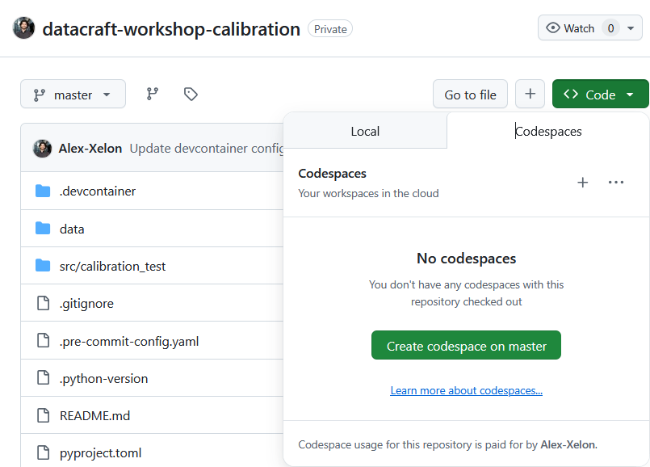
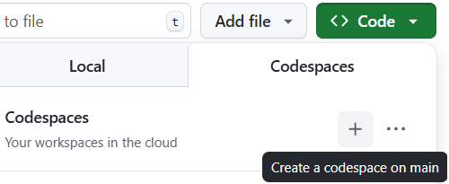

# Trustable IA Workshop – Enhancing Calibration for Reliable AI Predictions


\


Welcome to this hands-on workshop on **AI Model Calibration**, a fundamental aspect of developing reliable and trustworthy machine learning systems. Through practical exercises and real-world examples, you'll master the art of calibrating your models to ensure their probability predictions accurately reflect real-world outcomes.

---

## Table of Contents
- **[Learning Objectives](#learning-objectives)**
- **[Workshop Structure](#workshop-structure)**
- **[Repository Organization](#repository-organization)**
- **[Getting Started](#getting-started)**

---

## Learning Objectives

After completing this workshop, you will be able to:
- Understand why **model calibration** is crucial for trustworthy AI systems
- Master various calibration techniques including:
  - Platt Scaling
  - Isotonic Regression
  - Venn-Abers
- Apply these techniques to real-world datasets
- Assess calibration quality using:
  - Reliability diagrams
  - Brier Score
  - Expected Calibration Error (ECE)
- Make informed decisions about when and how to calibrate your models

## Workshop Structure

The workshop is organized around progressive tutorials that build your understanding
of model calibration, it designed to suit learners of all levels.

- The workshop is divided into **three progressive stages**:
  - **`stage_1`**: Binary classification calibration
  - **`stage_2`**: Multi-class calibration challenges
  - **`stage_3`**: Multi-label calibration scenarios

> Start with the `main` branch to understand the theoretical foundations. Choose your challenge level based on your experience with machine learning and probability theory. Feel free to start with the `hard` branch if you're up for a challenge. If it gets tricky, switch to `intermediate` or `easy` for progressive hints.

## Repository Organization

| Branch         | Purpose                                                                    |
|----------------|----------------------------------------------------------------------------|
| `main`         | Core concepts and theoretical foundations of model calibration             |
| `easy`         | Beginner-friendly version with step-by-step guidance                      |
| `intermediate` | Standard version with partial implementation guidance                      |
| `hard`         | Advanced challenges for experienced practitioners                          |
| `correction`   | Complete solutions with detailed explanations                             |

> **Recommendation**: Start with the `main` branch to grasp the theoretical foundations. Choose your subsequent branch based on your experience level. Feel free to start with the `hard` branch if you're up for a challenge. If it gets tricky, switch to `intermediate` or `easy` for progressive hints. Even if you're experienced, the `easy` branch can provide valuable insights into best practices.

### Directory Structure

The workshop materials are organized as follows:

- **Core Components**:
  - `data/`: Curated datasets for training and validation exercises
  - `src/calibration/`: Marimo notebooks containing step-by-step tutorials and hands-on examples
  - `plots/`: Visual aids including reliability diagrams, calibration curves, and performance metrics
  - `TODO.md`: Detailed instructions and learning milestones for each stage

The `correction` branch provides complete implementations and detailed explanations

### Navigating the Workshop

This workshop offers different difficulty levels to match your learning pace. To switch between levels:

```bash
git checkout <branch-name>
```

Replace `<branch-name>` with one of the following :

- `main`         → basic explanation and introduction
- `easy`         → Step-by-step version
- `intermediate` → standard level
- `hard`         → advanced version
- `correction`   → Complete solution

---

## Setup

Choose your preferred environment to complete this workshop:

### Option 1 — Local Setup (VSCode/Cursor)

If you're comfortable working locally, simply clone the repository and follow the common instructions above.

1. Clone the repository
2. Install the Python package manager `uv`:
   ```bash
   curl -LsSf https://astral.sh/uv/install.sh | sh
   ```
  >If the uv installation fails or you're having trouble with
  your virtual environment, you can try running the workshop in the cloud using GitHub Codespaces instead.
3. Install dependencies:
   ```bash
   uv sync
   ```
4. Activate the virtual environment:
   ```bash
   source .venv/bin/activate
   ```

> **Note** : If you encounter issues with `uv` or virtual environments, you can try running the workshop in the cloud using GitHub Codespaces instead (option 2).

### Option 2 — Cloud Setup (GitHub Codespaces)

For a zero-installation experience directly in your browser:

1. Go to the repository on GitHub
2. Select your desired branch (`main`, `easy`, etc.)
3. Click the green "Code" button → "Create codespace"
4. Once the Codespace loads, run:
   ```bash
   uv sync
   source .venv/bin/activate
   ```
   You're now ready to start coding!



> **Important**: Each Codespace is tied to the branch you selected when creating it. To switch branches, go back to GitHub, select the new branch, and click on the + icon in the top right corner to create a new Codespace for that branch then repeat step 4.

<p align="center">
  
</p>

---

*You're now all set — pick your branch, open the tutorial, and start exploring model calibration!*
